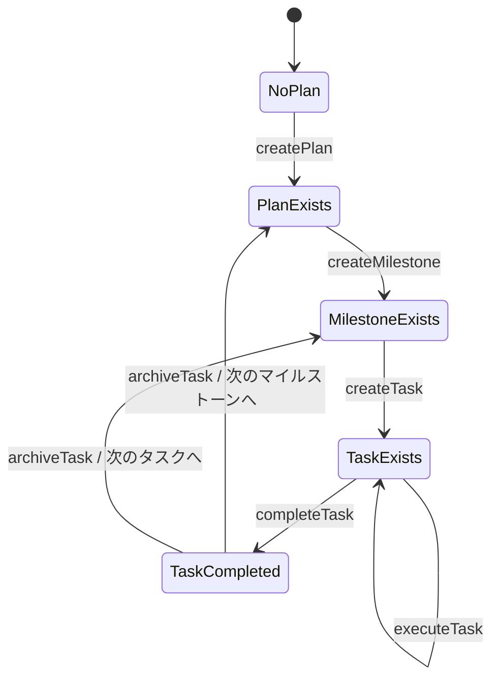

# プロジェクト状態定義（State & Flow）

## 状態（State）

- `NoPlan`（計画がない）
  - 許可されるふるまい: `createPlan`
  - 遷移先: `PlanExists`
- `PlanExists`（計画はあるがマイルストーンがない）
  - 許可されるふるまい: `createMilestone`
  - 遷移先: `MilestoneExists`
- `MilestoneExists`（マイルストーンはあるがタスクがない）
  - 許可されるふるまい: `createTask`
  - 遷移先: `TaskExists`
- `TaskExists`（タスクがある）
  - 許可されるふるまい: `executeTask`, `completeTask`
  - 遷移先: `TaskCompleted`
- `TaskCompleted`（タスク完了）
  - 許可されるふるまい: `archiveTask`, `updateCurrentWork`
  - 遷移先: `PlanExists` または `MilestoneExists`（次のタスク・マイルストーンへ）

## ふるまい（Action）
- `createPlan`: プロジェクト計画書を作成する
    - 詳細手順は [actions/createPlan.md](actions/createPlan.md) を参照
- `createMilestone`: マイルストーン詳細を作成する
    - 詳細手順は [actions/createMilestone.md](actions/createMilestone.md) を参照
- `createTask`: タスクを作成する
    - 詳細手順は [actions/createTask.md](actions/createTask.md) を参照
- `executeTask`: タスクを実行する
    - 詳細手順は [actions/executeTask.md](actions/executeTask.md) を参照
- `completeTask`: タスクを完了状態にする
    - 詳細手順は [actions/completeTask.md](actions/completeTask.md) を参照
- `archiveTask`: タスクをアーカイブする
    - 詳細手順は [actions/archiveTask.md](actions/archiveTask.md) を参照
- `updateCurrentWork`: 現在の作業状況を更新する
    - 詳細手順は [actions/updateCurrentWork.md](actions/updateCurrentWork.md) を参照

## 状態遷移図

